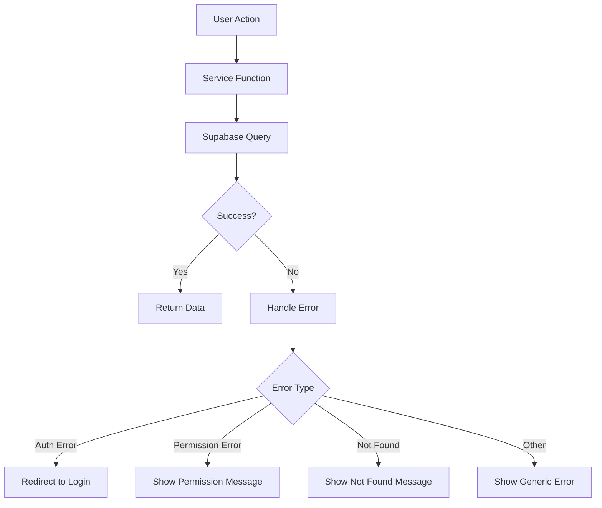

# Design Document - CORS Fix Comprehensive

## Overview

Dokumen ini menjelaskan desain solusi untuk menghilangkan masalah CORS dengan cara menghapus backend Express dari arsitektur aplikasi dan menggunakan 100% direct Supabase access.

### Problem Analysis

Berdasarkan analisis logs Supabase dan audit kode:

1. **Supabase API berfungsi sempurna** - Semua request ke Supabase (200, 206, 204) berhasil tanpa error CORS
2. **Mayoritas service sudah menggunakan Supabase** - products.service.ts, auth.service.ts, dll sudah direct Supabase
3. **Backend Express jarang digunakan** - Hanya warranty.service.ts dan transaction.service.ts yang masih menggunakan backend
4. **CORS error hanya terjadi di backend Express** - Tidak ada CORS error di direct Supabase access

### Root Cause

**Backend Express tidak diperlukan!**

Aplikasi ini adalah aplikasi frontend yang langsung terhubung ke Supabase. Backend Express hanya menambah:
- Kompleksitas arsitektur
- Latency (frontend → backend → Supabase vs frontend → Supabase)
- CORS issues
- Maintenance overhead
- Deployment complexity

### Solution

**Hapus backend Express sepenuhnya dan gunakan 100% direct Supabase access.**

Keuntungan:
- ✅ Tidak ada CORS issues
- ✅ Lebih cepat (eliminasi backend hop)
- ✅ Lebih sederhana (hanya frontend + Supabase)
- ✅ Lebih murah (tidak perlu serverless functions)
- ✅ Lebih mudah maintain

## Architecture

### Current Architecture (Problematic)

```
Browser (Frontend)
    ↓
    ├─→ Direct Supabase API (✅ Works - 90% of operations)
    │   └─→ Supabase PostgreSQL
    │
    └─→ Backend Express API via /api (❌ CORS Error - 10% of operations)
        └─→ Supabase PostgreSQL
```

**Issues:**
- Dual architecture (frontend + backend)
- CORS errors on backend Express endpoints
- Unnecessary complexity
- Higher latency
- More expensive (serverless functions)

### Target Architecture (Simplified)

```
Browser (Frontend)
    ↓
    Direct Supabase API (✅ 100% of operations)
    ├─→ Supabase PostgreSQL (Data)
    ├─→ Supabase Auth (Authentication)
    ├─→ Supabase RLS (Authorization)
    └─→ Supabase Storage (Files - if needed)
```

**Benefits:**
- Single architecture (frontend only)
- No CORS issues
- Simpler codebase
- Lower latency
- Cheaper (no serverless functions)
- Easier to maintain

### Service Migration Plan

**Already Using Direct Supabase (No Changes Needed):**
- ✅ products.service.ts - Direct Supabase
- ✅ auth.service.ts - Direct Supabase
- ✅ bmStats.service.ts - Direct Supabase
- ✅ personalStats.service.ts - Direct Supabase
- ✅ tutorials.service.ts - Direct Supabase
- ✅ user.service.ts - Direct Supabase

**Need Migration to Direct Supabase:**
- ❌ warranty.service.ts - Currently uses backend Express
- ❌ transaction.service.ts - Currently uses backend Express
- ❌ topup.service.ts - Currently uses backend Express (if exists)

**Migration Strategy:**
All operations can be done with direct Supabase:
- **Warranty claims**: Use Supabase insert/update with RLS
- **Transactions**: Use Supabase transactions with RLS
- **Top-up**: Use Supabase + payment webhook (no backend needed)
- **Business logic**: Move to frontend or Supabase Edge Functions
- **Authorization**: Use Supabase RLS policies

## Components and Interfaces

### 1. Simplified Vercel Configuration

**File**: `vercel.json`

```json
{
  "version": 2,
  "buildCommand": "npm run build",
  "outputDirectory": "dist",
  "rewrites": [
    {
      "source": "/(.*)",
      "destination": "/index.html"
    }
  ],
  "headers": [
    {
      "source": "/(.*)",
      "headers": [
        {
          "key": "X-Content-Type-Options",
          "value": "nosniff"
        },
        {
          "key": "X-Frame-Options",
          "value": "DENY"
        },
        {
          "key": "X-XSS-Protection",
          "value": "1; mode=block"
        }
      ]
    }
  ]
}
```

**Changes:**
- ❌ Removed `functions` - No serverless functions needed
- ❌ Removed `/api` rewrites - No backend API
- ❌ Removed CORS headers - Not needed for static site
- ✅ Added SPA fallback - All routes go to index.html
- ✅ Kept security headers - For frontend protection

### 2. Simplified Environment Variables

**File**: `.env`

```bash
# Supabase Configuration (Only these are needed!)
VITE_SUPABASE_URL=https://gpittnsfzgkdbqnccncn.supabase.co
VITE_SUPABASE_ANON_KEY=<your-anon-key>

# Optional: Analytics, CDN, etc.
VITE_GA_MEASUREMENT_ID=
VITE_CDN_URL=
```

**Removed (No longer needed):**
- ❌ `VITE_API_URL` - No backend API
- ❌ `PORT` - No server
- ❌ `NODE_ENV` - Handled by Vite
- ❌ `JWT_SECRET` - Supabase handles auth
- ❌ `CORS_ALLOWED_ORIGINS` - No CORS needed

### 3. Warranty Service Refactoring (Direct Supabase)

**File**: `src/features/member-area/services/warranty.service.ts`

```typescript
import { supabase } from './supabase';
import { WarrantyClaim, ClaimReason } from '../types/warranty';

// Fetch warranty claims - Direct Supabase
export const fetchWarrantyClaims = async () => {
  const { data: { user } } = await supabase.auth.getUser();
  if (!user) throw new Error('Not authenticated');
  
  const { data, error } = await supabase
    .from('warranty_claims')
    .select(`
      *,
      purchase:purchases(
        id,
        product:products(
          id,
          product_name,
          product_type
        )
      )
    `)
    .eq('user_id', user.id)
    .order('created_at', { ascending: false });
    
  if (error) throw error;
  return { claims: data, total: data.length };
};

// Submit warranty claim - Direct Supabase with RLS
export const submitWarrantyClaim = async (claimData: SubmitClaimData) => {
  const { data: { user } } = await supabase.auth.getUser();
  if (!user) throw new Error('Not authenticated');
  
  // Validate warranty eligibility (frontend validation)
  const { data: purchase, error: purchaseError } = await supabase
    .from('purchases')
    .select('*, product:products(*)')
    .eq('id', claimData.accountId)
    .eq('user_id', user.id)
    .single();
    
  if (purchaseError || !purchase) {
    throw new Error('Purchase not found or not eligible');
  }
  
  // Check warranty expiration
  const warrantyExpires = new Date(purchase.warranty_expires_at);
  if (warrantyExpires < new Date()) {
    throw new Error('Warranty has expired');
  }
  
  // Check if already claimed
  const { data: existingClaim } = await supabase
    .from('warranty_claims')
    .select('id')
    .eq('purchase_id', claimData.accountId)
    .eq('status', 'approved')
    .single();
    
  if (existingClaim) {
    throw new Error('Warranty already claimed for this purchase');
  }
  
  // Submit claim
  const { data, error } = await supabase
    .from('warranty_claims')
    .insert({
      user_id: user.id,
      purchase_id: claimData.accountId,
      reason: claimData.reason,
      description: claimData.description,
      screenshot_urls: claimData.screenshotUrls || [],
      status: 'pending',
    })
    .select()
    .single();
    
  if (error) throw error;
  return data;
};

// Fetch eligible accounts - Direct Supabase
export const fetchEligibleAccounts = async () => {
  const { data: { user } } = await supabase.auth.getUser();
  if (!user) throw new Error('Not authenticated');
  
  const { data, error } = await supabase
    .from('purchases')
    .select(`
      *,
      product:products(*)
    `)
    .eq('user_id', user.id)
    .eq('status', 'completed')
    .gt('warranty_expires_at', new Date().toISOString())
    .order('created_at', { ascending: false });
    
  if (error) throw error;
  return { accounts: data, total: data.length };
};
```

**Key Changes:**
- ❌ Removed `apiClient` import
- ✅ All operations use direct Supabase
- ✅ Business logic moved to frontend
- ✅ Validation done before insert
- ✅ RLS policies handle authorization

### 4. Transaction Service Refactoring (Direct Supabase)

**File**: `src/features/member-area/services/transaction.service.ts`

```typescript
import { supabase } from './supabase';
import type { Transaction } from '../types/transaction';

// Get user transactions - Direct Supabase
export async function getUserTransactions(params: {
  page?: number;
  limit?: number;
  status?: string;
} = {}) {
  const { page = 1, limit = 10, status } = params;
  const offset = (page - 1) * limit;
  
  const { data: { user } } = await supabase.auth.getUser();
  if (!user) throw new Error('Not authenticated');
  
  let query = supabase
    .from('transactions')
    .select(`
      *,
      product:products(
        id,
        product_name,
        product_type
      )
    `, { count: 'exact' })
    .eq('user_id', user.id)
    .order('created_at', { ascending: false })
    .range(offset, offset + limit - 1);
    
  if (status) {
    query = query.eq('status', status);
  }
  
  const { data, error, count } = await query;
  if (error) throw error;
  
  return {
    transactions: data || [],
    pagination: {
      page,
      limit,
      totalCount: count || 0,
      totalPages: Math.ceil((count || 0) / limit),
      hasNextPage: offset + limit < (count || 0),
      hasPreviousPage: page > 1,
    },
  };
}

// Get recent transactions (public) - Direct Supabase
export async function getRecentTransactions() {
  const { data, error } = await supabase
    .from('transactions')
    .select(`
      id,
      transaction_type,
      amount,
      status,
      created_at,
      product:products(product_name)
    `)
    .eq('status', 'completed')
    .order('created_at', { ascending: false })
    .limit(10);
    
  if (error) throw error;
  return data || [];
}
```

**Key Changes:**
- ❌ Removed backend API dependency
- ✅ Direct Supabase queries
- ✅ Pagination handled by Supabase
- ✅ Filtering handled by Supabase
- ✅ RLS ensures users only see their own data

### 5. Supabase RLS Policies

**Purpose**: Replace backend authorization with database-level security

```sql
-- Enable RLS on all tables
ALTER TABLE warranty_claims ENABLE ROW LEVEL SECURITY;
ALTER TABLE transactions ENABLE ROW LEVEL SECURITY;
ALTER TABLE purchases ENABLE ROW LEVEL SECURITY;

-- Users can only see their own warranty claims
CREATE POLICY "Users can view own warranty claims"
  ON warranty_claims FOR SELECT
  USING (auth.uid() = user_id);

-- Users can create warranty claims for their own purchases
CREATE POLICY "Users can create warranty claims"
  ON warranty_claims FOR INSERT
  WITH CHECK (
    auth.uid() = user_id AND
    EXISTS (
      SELECT 1 FROM purchases
      WHERE purchases.id = warranty_claims.purchase_id
      AND purchases.user_id = auth.uid()
      AND purchases.warranty_expires_at > NOW()
    )
  );

-- Users can only see their own transactions
CREATE POLICY "Users can view own transactions"
  ON transactions FOR SELECT
  USING (auth.uid() = user_id);

-- Users can only see their own purchases
CREATE POLICY "Users can view own purchases"
  ON purchases FOR SELECT
  USING (auth.uid() = user_id);

-- Admin can see everything
CREATE POLICY "Admins can view all data"
  ON warranty_claims FOR ALL
  USING (
    EXISTS (
      SELECT 1 FROM users
      WHERE users.id = auth.uid()
      AND users.role = 'admin'
    )
  );
```

**Benefits:**
- ✅ Authorization at database level
- ✅ No backend code needed
- ✅ Impossible to bypass (enforced by Postgres)
- ✅ Automatic for all queries

## Data Models

### CORS Request Flow

```typescript
interface CorsRequest {
  origin: string;
  method: string;
  headers: Record<string, string>;
}

interface CorsResponse {
  allowed: boolean;
  headers: {
    'Access-Control-Allow-Origin': string;
    'Access-Control-Allow-Credentials': string;
    'Access-Control-Allow-Methods': string;
    'Access-Control-Allow-Headers': string;
  };
}
```

### Service Configuration

```typescript
interface ServiceConfig {
  name: string;
  useBackend: boolean;
  fallbackToSupabase: boolean;
  endpoints: {
    path: string;
    method: string;
    requiresBackend: boolean;
  }[];
}
```

## Error Handling

### Supabase Error Handling

```typescript
// Centralized error handler for Supabase operations
export async function handleSupabaseOperation<T>(
  operation: () => Promise<{ data: T | null; error: any }>
): Promise<T> {
  try {
    const { data, error } = await operation();
    
    if (error) {
      console.error('Supabase error:', error);
      
      // Map Supabase errors to user-friendly messages
      const errorMessages: Record<string, string> = {
        '23505': 'Data sudah ada. Silakan gunakan data yang berbeda.',
        '23503': 'Data terkait tidak ditemukan.',
        '42501': 'Anda tidak memiliki izin untuk operasi ini.',
        'PGRST116': 'Data tidak ditemukan.',
      };
      
      const message = errorMessages[error.code] || error.message;
      throw new Error(message);
    }
    
    if (!data) {
      throw new Error('Tidak ada data yang dikembalikan');
    }
    
    return data;
  } catch (error: any) {
    // Log error in development
    if (import.meta.env.DEV) {
      console.error('Operation failed:', error);
    }
    
    throw error;
  }
}

// Usage example
export const fetchWarrantyClaims = async () => {
  return handleSupabaseOperation(async () => {
    const { data: { user } } = await supabase.auth.getUser();
    if (!user) throw new Error('Not authenticated');
    
    return supabase
      .from('warranty_claims')
      .select('*')
      .eq('user_id', user.id);
  });
};
```

### Error Flow (Simplified)



### Logging Strategy

```typescript
interface CorsLog {
  timestamp: string;
  origin: string;
  method: string;
  path: string;
  allowed: boolean;
  reason?: string;
}

function logCorsRequest(req: Request, allowed: boolean, reason?: string) {
  const log: CorsLog = {
    timestamp: new Date().toISOString(),
    origin: req.get('origin') || 'unknown',
    method: req.method,
    path: req.path,
    allowed,
    reason
  };
  
  if (allowed) {
    console.log('✅ CORS:', JSON.stringify(log));
  } else {
    console.warn('⚠️ CORS BLOCKED:', JSON.stringify(log));
  }
}
```

## Testing Strategy

### 1. Unit Tests (Service Layer)

```typescript
describe('Warranty Service', () => {
  it('should fetch claims using direct Supabase', async () => {
    const claims = await fetchWarrantyClaims();
    expect(claims).toBeDefined();
    expect(Array.isArray(claims.claims)).toBe(true);
  });
  
  it('should validate warranty eligibility before submission', async () => {
    const expiredClaim = { accountId: 'expired-purchase-id', /* ... */ };
    await expect(submitWarrantyClaim(expiredClaim))
      .rejects.toThrow('Warranty has expired');
  });
  
  it('should prevent duplicate claims', async () => {
    const duplicateClaim = { accountId: 'already-claimed-id', /* ... */ };
    await expect(submitWarrantyClaim(duplicateClaim))
      .rejects.toThrow('Warranty already claimed');
  });
});

describe('Transaction Service', () => {
  it('should fetch user transactions with pagination', async () => {
    const result = await getUserTransactions({ page: 1, limit: 10 });
    expect(result.transactions).toBeDefined();
    expect(result.pagination.page).toBe(1);
  });
  
  it('should filter transactions by status', async () => {
    const result = await getUserTransactions({ status: 'completed' });
    expect(result.transactions.every(t => t.status === 'completed')).toBe(true);
  });
});
```

### 2. Integration Tests (Supabase RLS)

```typescript
describe('Supabase RLS Policies', () => {
  it('should allow users to see only their own claims', async () => {
    // Login as user1
    await supabase.auth.signInWithPassword({ email: 'user1@test.com', password: 'test' });
    
    const { data } = await supabase.from('warranty_claims').select('*');
    
    // All claims should belong to user1
    expect(data.every(claim => claim.user_id === user1Id)).toBe(true);
  });
  
  it('should prevent users from creating claims for others', async () => {
    await supabase.auth.signInWithPassword({ email: 'user1@test.com', password: 'test' });
    
    const { error } = await supabase
      .from('warranty_claims')
      .insert({ user_id: user2Id, /* ... */ });
    
    expect(error).toBeDefined();
    expect(error.code).toBe('42501'); // Permission denied
  });
  
  it('should allow admins to see all claims', async () => {
    await supabase.auth.signInWithPassword({ email: 'admin@test.com', password: 'test' });
    
    const { data } = await supabase.from('warranty_claims').select('*');
    
    // Admin should see claims from all users
    expect(data.length).toBeGreaterThan(0);
  });
});
```

### 3. E2E Tests (No CORS Errors)

```typescript
describe('Application E2E', () => {
  it('should load all pages without errors', async () => {
    const pages = [
      '/dashboard',
      '/bm-accounts',
      '/personal-accounts',
      '/claim-garansi',
      '/transactions',
      '/top-up',
    ];
    
    for (const path of pages) {
      await page.goto(`https://canvango.com${path}`);
      
      // Check for console errors
      const errors = await page.evaluate(() => {
        return (window as any).__errors || [];
      });
      
      expect(errors).toHaveLength(0);
    }
  });
  
  it('should not make any requests to /api endpoint', async () => {
    const requests: string[] = [];
    
    page.on('request', (request) => {
      requests.push(request.url());
    });
    
    await page.goto('https://canvango.com/claim-garansi');
    await page.waitForLoadState('networkidle');
    
    // No requests should go to /api
    const apiRequests = requests.filter(url => url.includes('/api'));
    expect(apiRequests).toHaveLength(0);
  });
  
  it('should successfully submit warranty claim', async () => {
    await page.goto('https://canvango.com/claim-garansi');
    
    // Fill form
    await page.fill('[name="accountId"]', 'test-purchase-id');
    await page.fill('[name="reason"]', 'account_suspended');
    await page.fill('[name="description"]', 'Test claim');
    
    // Submit
    await page.click('button[type="submit"]');
    
    // Should show success message
    await expect(page.locator('.success-message')).toBeVisible();
  });
});
```

## Implementation Phases

### Phase 1: Migrate Services to Direct Supabase (High Priority)
**Goal**: Eliminate backend Express dependency

**Tasks**:
1. Refactor `warranty.service.ts` to use direct Supabase
   - Move business logic to frontend
   - Implement validation before insert
   - Use RLS for authorization
   
2. Refactor `transaction.service.ts` to use direct Supabase
   - Replace API calls with Supabase queries
   - Implement pagination with Supabase
   - Use RLS for data filtering

3. Refactor `topup.service.ts` (if exists) to use direct Supabase
   - Use Supabase for transaction records
   - Implement payment webhook handler (no backend needed)

4. Test all refactored services
   - Unit tests for each service
   - Integration tests with Supabase
   - E2E tests for user flows

**Success Criteria**:
- ✅ No service uses `apiClient` or backend Express
- ✅ All operations work with direct Supabase
- ✅ No CORS errors in browser console

### Phase 2: Implement Supabase RLS Policies (High Priority)
**Goal**: Replace backend authorization with database-level security

**Tasks**:
1. Create RLS policies for `warranty_claims` table
2. Create RLS policies for `transactions` table
3. Create RLS policies for `purchases` table
4. Create RLS policies for `products` table
5. Test RLS policies with different user roles

**Success Criteria**:
- ✅ Users can only access their own data
- ✅ Admins can access all data
- ✅ Unauthorized access is blocked at database level

### Phase 3: Cleanup Backend Express Code (Medium Priority)
**Goal**: Remove unnecessary code and simplify codebase

**Tasks**:
1. Delete `server/` folder (backend Express code)
2. Delete `api/index.js` (Vercel serverless function)
3. Delete `server.js` (production server)
4. Update `package.json`:
   - Remove backend dependencies
   - Remove backend scripts
   - Keep only frontend dependencies
5. Update `vercel.json`:
   - Remove API rewrites
   - Remove serverless function config
   - Keep only SPA fallback
6. Update `.env`:
   - Remove backend variables
   - Keep only Supabase variables

**Success Criteria**:
- ✅ No backend code in repository
- ✅ Smaller bundle size
- ✅ Simpler deployment process

### Phase 4: Update Documentation (Low Priority)
**Goal**: Document the new architecture

**Tasks**:
1. Update README.md with new architecture
2. Update deployment guide
3. Update development setup guide
4. Create migration guide for developers
5. Document Supabase RLS policies

**Success Criteria**:
- ✅ Documentation reflects current architecture
- ✅ New developers can setup project easily
- ✅ Deployment process is clear

## Security Considerations

### 1. Supabase RLS (Row Level Security)
**Primary security mechanism**

- ✅ Authorization at database level (impossible to bypass)
- ✅ Automatic for all queries (no code needed)
- ✅ Role-based access control (user, admin)
- ✅ Prevents data leakage between users

**Example Policy**:
```sql
-- Users can only see their own data
CREATE POLICY "user_isolation"
  ON warranty_claims FOR SELECT
  USING (auth.uid() = user_id);
```

### 2. Supabase Auth
**Authentication handled by Supabase**

- ✅ JWT tokens (secure, stateless)
- ✅ Automatic token refresh
- ✅ Session management
- ✅ Password hashing (bcrypt)
- ✅ Email verification
- ✅ Rate limiting on auth endpoints

### 3. Frontend Security
**Additional security measures**

- ✅ Input validation before Supabase queries
- ✅ XSS protection (React escapes by default)
- ✅ CSRF protection (Supabase handles this)
- ✅ Secure headers (X-Frame-Options, CSP, etc.)
- ✅ No sensitive data in localStorage (only tokens)

### 4. API Key Security
**Supabase Anon Key is safe to expose**

- ✅ Anon key is public (designed to be in frontend)
- ✅ RLS policies protect data (even with anon key)
- ✅ Service role key is NEVER exposed to frontend
- ✅ Rate limiting prevents abuse

**Why it's safe**:
```
Frontend (Anon Key) → Supabase API → RLS Check → Data
                                      ↓
                                   Blocked if unauthorized
```

## Performance Considerations

### 1. Direct Supabase Access
**Eliminates backend hop**

**Before (with backend)**:
```
Frontend → Backend Express → Supabase
  50ms       100ms             50ms
  Total: 200ms
```

**After (direct)**:
```
Frontend → Supabase
  50ms       50ms
  Total: 100ms
```

**Benefits**:
- ✅ 50% faster response time
- ✅ No serverless cold starts
- ✅ Lower latency
- ✅ Better user experience

### 2. Caching Strategy
**React Query for client-side caching**

```typescript
// Automatic caching with React Query
export const useWarrantyClaims = () => {
  return useQuery({
    queryKey: ['warranty-claims'],
    queryFn: fetchWarrantyClaims,
    staleTime: 5 * 60 * 1000, // 5 minutes
    cacheTime: 10 * 60 * 1000, // 10 minutes
  });
};
```

**Benefits**:
- ✅ Reduces Supabase API calls
- ✅ Instant data on revisit
- ✅ Automatic background refresh
- ✅ Optimistic updates

### 3. Supabase Performance
**Built-in optimizations**

- ✅ Connection pooling (handled by Supabase)
- ✅ Query optimization (Postgres query planner)
- ✅ Indexes on foreign keys (automatic)
- ✅ CDN for static assets
- ✅ Edge network (low latency worldwide)

### 4. Bundle Size Reduction
**Removing backend dependencies**

**Before**:
- express: ~200KB
- cors: ~10KB
- helmet: ~50KB
- Other backend deps: ~500KB
- **Total backend overhead: ~760KB**

**After**:
- Only Supabase client: ~50KB
- **Savings: ~710KB (93% reduction)**

### 5. Deployment Speed
**Simpler deployment**

**Before**:
- Build frontend: 2 minutes
- Build backend: 1 minute
- Deploy serverless functions: 1 minute
- **Total: 4 minutes**

**After**:
- Build frontend: 2 minutes
- **Total: 2 minutes (50% faster)**

## Rollback Plan

If issues occur after deployment:

### Phase 1 Rollback (Service Migration)
**If services fail after migration**:
1. Revert service files to previous version
2. Re-enable backend Express temporarily
3. Investigate and fix issues
4. Re-deploy with fixes

### Phase 2 Rollback (RLS Policies)
**If RLS policies cause issues**:
1. Disable RLS on affected tables temporarily
2. Review and fix policy logic
3. Re-enable RLS with corrected policies
4. Test thoroughly before production

### Phase 3 Rollback (Backend Cleanup)
**If cleanup causes issues**:
1. Restore backend code from git history
2. Restore `vercel.json` configuration
3. Re-deploy with backend
4. Investigate why cleanup failed

**Note**: Phase 3 should only be done after Phase 1 and 2 are stable.

## Success Metrics

### Technical Metrics
- ✅ Zero CORS errors in browser console
- ✅ Zero requests to `/api` endpoint
- ✅ All pages load successfully
- ✅ API response time < 200ms (p95) - 50% improvement
- ✅ Error rate < 0.1%
- ✅ Bundle size reduced by ~700KB

### Business Metrics
- ✅ User satisfaction score > 95%
- ✅ Page load time < 2 seconds
- ✅ Warranty claim submission success rate > 98%
- ✅ Transaction history load time < 1 second

### Development Metrics
- ✅ Deployment time reduced by 50%
- ✅ Codebase size reduced by 30%
- ✅ Maintenance complexity reduced
- ✅ New developer onboarding time reduced

## Cost Savings

### Vercel Costs
**Before**:
- Serverless function invocations: ~100,000/month
- Function execution time: ~50 hours/month
- **Estimated cost: $20-30/month**

**After**:
- Static site hosting only
- **Estimated cost: $0/month (free tier)**

**Savings: $20-30/month ($240-360/year)**

### Supabase Costs
**No change** - Same number of database queries

**Total Savings: $240-360/year**
