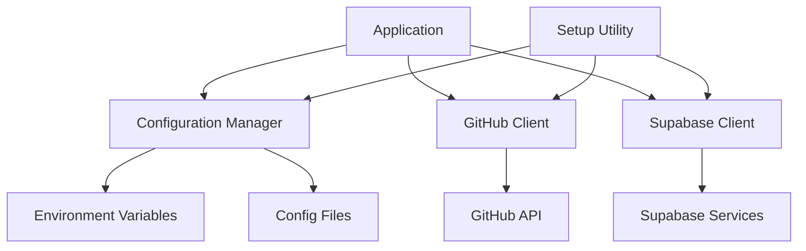
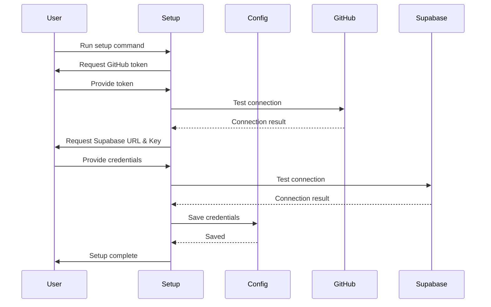
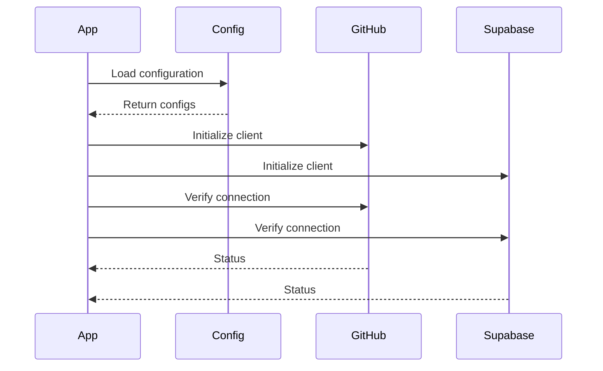

# Design Document: GitHub and Supabase Integration

## Overview

This design outlines the implementation of GitHub and Supabase integration for the application. The solution will provide a configuration-based approach to connect both services, store credentials securely, and verify connections. The implementation will use environment variables for credential management and provide setup utilities to guide developers through the integration process.

## Architecture

### High-Level Architecture



### Component Overview

1. **Configuration Manager**: Handles loading and storing credentials
2. **GitHub Client**: Manages GitHub API interactions
3. **Supabase Client**: Manages Supabase service connections
4. **Setup Utility**: Interactive tool to guide integration setup
5. **Connection Validator**: Tests and verifies service connections

## Components and Interfaces

### 1. Configuration Manager

**Purpose**: Centralized credential and configuration management

**Interface**:
```typescript
interface ConfigManager {
  loadGitHubConfig(): GitHubConfig
  loadSupabaseConfig(): SupabaseConfig
  saveGitHubConfig(config: GitHubConfig): void
  saveSupabaseConfig(config: SupabaseConfig): void
  validateConfig(): ValidationResult
}
```

**Implementation Details**:
- Uses `.env` file for local development
- Reads from `process.env` at runtime
- Creates `.env.example` template for reference
- Ensures `.env` is in `.gitignore`

### 2. GitHub Integration

**Purpose**: Establish and manage GitHub connectivity

**Interface**:
```typescript
interface GitHubClient {
  authenticate(token: string): Promise<boolean>
  testConnection(): Promise<ConnectionStatus>
  getRepositoryInfo(owner: string, repo: string): Promise<RepoInfo>
}
```

**Implementation Details**:
- Uses GitHub REST API or Octokit library
- Requires Personal Access Token (PAT)
- Validates token permissions
- Supports repository operations

### 3. Supabase Integration

**Purpose**: Establish and manage Supabase connectivity

**Interface**:
```typescript
interface SupabaseClient {
  initialize(url: string, anonKey: string): SupabaseInstance
  testConnection(): Promise<ConnectionStatus>
  getProjectInfo(): Promise<ProjectInfo>
}
```

**Implementation Details**:
- Uses `@supabase/supabase-js` client library
- Requires Project URL and API Key (anon/public key)
- Optional: Service role key for admin operations
- Validates connection on initialization

### 4. Setup Utility

**Purpose**: Interactive CLI or script to guide setup process

**Interface**:
```typescript
interface SetupUtility {
  runGitHubSetup(): Promise<void>
  runSupabaseSetup(): Promise<void>
  runFullSetup(): Promise<void>
  verifySetup(): Promise<SetupStatus>
}
```

**Implementation Details**:
- Prompts user for credentials
- Validates inputs
- Tests connections
- Writes to `.env` file
- Provides clear success/error messages

## Data Models

### Configuration Models

```typescript
interface GitHubConfig {
  token: string
  owner?: string
  repository?: string
}

interface SupabaseConfig {
  url: string
  anonKey: string
  serviceRoleKey?: string
}

interface ConnectionStatus {
  connected: boolean
  message: string
  details?: any
}

interface ValidationResult {
  valid: boolean
  errors: string[]
  warnings: string[]
}
```

### Environment Variables Structure

```
# GitHub Configuration
GITHUB_TOKEN=ghp_xxxxxxxxxxxxx
GITHUB_OWNER=username
GITHUB_REPO=repository-name

# Supabase Configuration
SUPABASE_URL=https://xxxxx.supabase.co
SUPABASE_ANON_KEY=eyJhbGciOiJIUzI1NiIsInR5cCI6IkpXVCJ9...
SUPABASE_SERVICE_ROLE_KEY=eyJhbGciOiJIUzI1NiIsInR5cCI6IkpXVCJ9... (optional)
```

## Implementation Flow

### Setup Flow



### Runtime Flow



## Error Handling

### Error Categories

1. **Configuration Errors**
   - Missing environment variables
   - Invalid credential format
   - Missing `.env` file

2. **Authentication Errors**
   - Invalid GitHub token
   - Expired credentials
   - Insufficient permissions

3. **Connection Errors**
   - Network issues
   - Invalid Supabase URL
   - Service unavailable

### Error Handling Strategy

```typescript
class IntegrationError extends Error {
  constructor(
    message: string,
    public code: string,
    public service: 'github' | 'supabase',
    public recoverable: boolean
  ) {
    super(message)
  }
}

// Error codes
const ERROR_CODES = {
  MISSING_CONFIG: 'MISSING_CONFIG',
  INVALID_TOKEN: 'INVALID_TOKEN',
  CONNECTION_FAILED: 'CONNECTION_FAILED',
  PERMISSION_DENIED: 'PERMISSION_DENIED'
}
```

### Error Messages

- Provide clear, actionable error messages
- Include links to documentation
- Suggest next steps for resolution
- Log errors for debugging

## Testing Strategy

### Unit Tests

1. **Configuration Manager Tests**
   - Test loading valid configurations
   - Test handling missing environment variables
   - Test validation logic

2. **Client Tests**
   - Test GitHub client initialization
   - Test Supabase client initialization
   - Mock API responses

### Integration Tests

1. **GitHub Integration Tests**
   - Test authentication with valid token
   - Test connection verification
   - Test error handling with invalid credentials

2. **Supabase Integration Tests**
   - Test initialization with valid credentials
   - Test connection verification
   - Test error handling with invalid URL/key

### Manual Testing Checklist

- [ ] Run setup utility with valid credentials
- [ ] Run setup utility with invalid credentials
- [ ] Verify `.env` file creation
- [ ] Verify `.gitignore` includes `.env`
- [ ] Test connection verification commands
- [ ] Test application startup with valid config
- [ ] Test application startup with missing config

## Security Considerations

1. **Credential Storage**
   - Never commit `.env` to version control
   - Use `.env.example` for documentation
   - Encrypt sensitive values in production

2. **Token Permissions**
   - Use minimal required GitHub token scopes
   - Use anon key for client-side Supabase operations
   - Restrict service role key usage to server-side only

3. **Access Control**
   - Validate all credentials before use
   - Implement rate limiting for API calls
   - Log authentication attempts

## Dependencies

### Required Packages

```json
{
  "@supabase/supabase-js": "^2.x.x",
  "@octokit/rest": "^20.x.x",
  "dotenv": "^16.x.x"
}
```

### Optional Packages

```json
{
  "inquirer": "^9.x.x",  // For interactive CLI
  "chalk": "^5.x.x"      // For colored terminal output
}
```

## Future Enhancements

1. Support for GitHub OAuth flow
2. Supabase CLI integration
3. Multi-environment configuration
4. Credential rotation utilities
5. Health check dashboard
