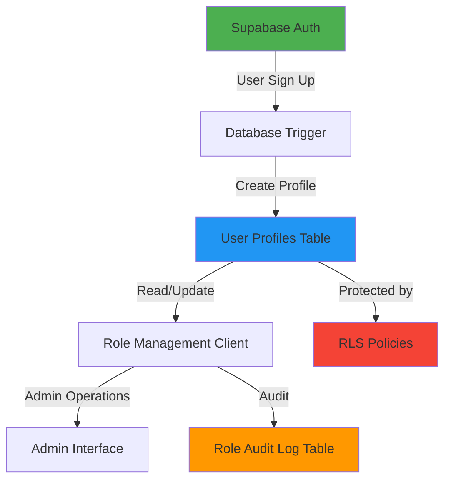
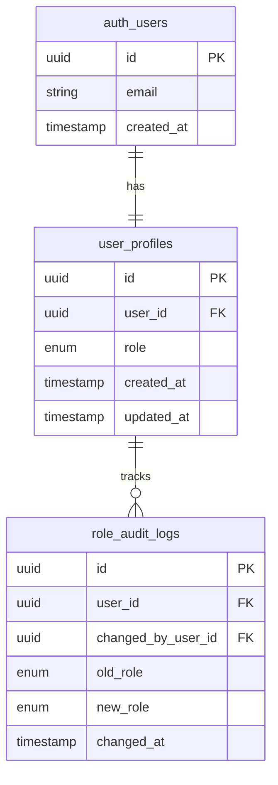

# Design Document - Role Management System

## Overview

Role Management System adalah fitur untuk mengelola peran pengguna (member dan admin) dalam aplikasi berbasis Supabase. Sistem ini dirancang dengan pendekatan database-first, memanfaatkan Supabase Auth, PostgreSQL triggers, dan Row Level Security (RLS) untuk memastikan keamanan dan konsistensi data.

Sistem ini terdiri dari:
- Database schema dengan tabel user profiles dan audit logs
- Database triggers untuk auto-assignment role default
- RLS policies untuk kontrol akses
- TypeScript client untuk operasi role management
- Admin interface untuk mengelola user roles

## Architecture

### High-Level Architecture



### Technology Stack

- **Database**: PostgreSQL (Supabase)
- **Authentication**: Supabase Auth
- **Backend**: TypeScript dengan @supabase/supabase-js
- **Security**: Row Level Security (RLS)
- **Frontend**: TypeScript/React (untuk Admin Interface)

### Database Architecture



## Components and Interfaces

### 1. Database Schema

#### User Profiles Table

```sql
CREATE TYPE user_role AS ENUM ('member', 'admin');

CREATE TABLE user_profiles (
    id UUID PRIMARY KEY DEFAULT gen_random_uuid(),
    user_id UUID REFERENCES auth.users(id) ON DELETE CASCADE UNIQUE NOT NULL,
    role user_role NOT NULL DEFAULT 'member',
    created_at TIMESTAMP WITH TIME ZONE DEFAULT NOW(),
    updated_at TIMESTAMP WITH TIME ZONE DEFAULT NOW()
);
```

#### Role Audit Log Table

```sql
CREATE TABLE role_audit_logs (
    id UUID PRIMARY KEY DEFAULT gen_random_uuid(),
    user_id UUID REFERENCES auth.users(id) ON DELETE CASCADE NOT NULL,
    changed_by_user_id UUID REFERENCES auth.users(id) ON DELETE SET NULL,
    old_role user_role,
    new_role user_role NOT NULL,
    changed_at TIMESTAMP WITH TIME ZONE DEFAULT NOW()
);
```

### 2. Database Triggers

#### Auto-Create Profile on User Sign Up

```sql
CREATE OR REPLACE FUNCTION handle_new_user()
RETURNS TRIGGER AS $$
BEGIN
    INSERT INTO public.user_profiles (user_id, role)
    VALUES (NEW.id, 'member');
    RETURN NEW;
END;
$$ LANGUAGE plpgsql SECURITY DEFINER;

CREATE TRIGGER on_auth_user_created
    AFTER INSERT ON auth.users
    FOR EACH ROW
    EXECUTE FUNCTION handle_new_user();
```

#### Auto-Update Timestamp

```sql
CREATE OR REPLACE FUNCTION update_updated_at()
RETURNS TRIGGER AS $$
BEGIN
    NEW.updated_at = NOW();
    RETURN NEW;
END;
$$ LANGUAGE plpgsql;

CREATE TRIGGER update_user_profiles_updated_at
    BEFORE UPDATE ON user_profiles
    FOR EACH ROW
    EXECUTE FUNCTION update_updated_at();
```

#### Audit Log Trigger

```sql
CREATE OR REPLACE FUNCTION log_role_change()
RETURNS TRIGGER AS $$
BEGIN
    IF OLD.role IS DISTINCT FROM NEW.role THEN
        INSERT INTO role_audit_logs (user_id, changed_by_user_id, old_role, new_role)
        VALUES (
            NEW.user_id,
            auth.uid(),
            OLD.role,
            NEW.role
        );
    END IF;
    RETURN NEW;
END;
$$ LANGUAGE plpgsql SECURITY DEFINER;

CREATE TRIGGER on_role_changed
    AFTER UPDATE ON user_profiles
    FOR EACH ROW
    EXECUTE FUNCTION log_role_change();
```

#### Prevent Last Admin Removal

```sql
CREATE OR REPLACE FUNCTION prevent_last_admin_removal()
RETURNS TRIGGER AS $$
DECLARE
    admin_count INTEGER;
BEGIN
    -- Only check if changing from admin to member
    IF OLD.role = 'admin' AND NEW.role = 'member' THEN
        SELECT COUNT(*) INTO admin_count
        FROM user_profiles
        WHERE role = 'admin' AND user_id != NEW.user_id;
        
        IF admin_count = 0 THEN
            RAISE EXCEPTION 'Cannot remove the last admin. At least one admin must exist.';
        END IF;
    END IF;
    
    RETURN NEW;
END;
$$ LANGUAGE plpgsql;

CREATE TRIGGER check_last_admin
    BEFORE UPDATE ON user_profiles
    FOR EACH ROW
    EXECUTE FUNCTION prevent_last_admin_removal();
```

### 3. Row Level Security (RLS) Policies

```sql
-- Enable RLS
ALTER TABLE user_profiles ENABLE ROW LEVEL SECURITY;
ALTER TABLE role_audit_logs ENABLE ROW LEVEL SECURITY;

-- Policy: Users can read their own profile
CREATE POLICY "Users can read own profile"
    ON user_profiles
    FOR SELECT
    USING (auth.uid() = user_id);

-- Policy: Admins can read all profiles
CREATE POLICY "Admins can read all profiles"
    ON user_profiles
    FOR SELECT
    USING (
        EXISTS (
            SELECT 1 FROM user_profiles
            WHERE user_id = auth.uid() AND role = 'admin'
        )
    );

-- Policy: Admins can update all profiles
CREATE POLICY "Admins can update all profiles"
    ON user_profiles
    FOR UPDATE
    USING (
        EXISTS (
            SELECT 1 FROM user_profiles
            WHERE user_id = auth.uid() AND role = 'admin'
        )
    );

-- Policy: Users cannot update their own role
CREATE POLICY "Users cannot update own role"
    ON user_profiles
    FOR UPDATE
    USING (auth.uid() != user_id);

-- Policy: Admins can read audit logs
CREATE POLICY "Admins can read audit logs"
    ON role_audit_logs
    FOR SELECT
    USING (
        EXISTS (
            SELECT 1 FROM user_profiles
            WHERE user_id = auth.uid() AND role = 'admin'
        )
    );
```

### 4. TypeScript Client - RoleManagementClient

```typescript
export interface UserProfile {
  id: string;
  user_id: string;
  role: 'member' | 'admin';
  created_at: string;
  updated_at: string;
}

export interface RoleAuditLog {
  id: string;
  user_id: string;
  changed_by_user_id: string | null;
  old_role: 'member' | 'admin' | null;
  new_role: 'member' | 'admin';
  changed_at: string;
}

export interface RoleChangeResult {
  success: boolean;
  message: string;
  profile?: UserProfile;
  error?: string;
}

export class RoleManagementClient {
  constructor(private supabaseClient: SupabaseInstance);
  
  // Get user profile with role
  async getUserProfile(userId: string): Promise<UserProfile | null>;
  
  // Get current user's role
  async getCurrentUserRole(): Promise<'member' | 'admin' | null>;
  
  // Check if current user is admin
  async isCurrentUserAdmin(): Promise<boolean>;
  
  // Get all user profiles (admin only)
  async getAllUserProfiles(): Promise<UserProfile[]>;
  
  // Update user role (admin only)
  async updateUserRole(
    userId: string,
    newRole: 'member' | 'admin'
  ): Promise<RoleChangeResult>;
  
  // Get role change history (admin only)
  async getRoleAuditLogs(userId?: string): Promise<RoleAuditLog[]>;
  
  // Get admin count
  async getAdminCount(): Promise<number>;
}
```

### 5. Admin Interface Components

#### UserRoleManager Component

```typescript
interface UserRoleManagerProps {
  roleClient: RoleManagementClient;
}

// Main component untuk menampilkan dan mengelola user roles
// Features:
// - Display list of all users with their roles
// - Filter by role (all/member/admin)
// - Search by email/name
// - Change role with confirmation dialog
// - Display success/error notifications
// - Show audit log for each user
```

#### RoleChangeConfirmation Component

```typescript
interface RoleChangeConfirmationProps {
  user: UserProfile;
  newRole: 'member' | 'admin';
  onConfirm: () => Promise<void>;
  onCancel: () => void;
}

// Dialog component untuk konfirmasi perubahan role
// Features:
// - Show current and new role
// - Warning if changing last admin
// - Confirm/Cancel buttons
```

#### AuditLogViewer Component

```typescript
interface AuditLogViewerProps {
  logs: RoleAuditLog[];
  loading: boolean;
}

// Component untuk menampilkan audit log
// Features:
// - Timeline view of role changes
// - Show who made the change
// - Filter by date range
// - Export to CSV
```

## Data Models

### TypeScript Types

```typescript
// Enums
export enum UserRole {
  MEMBER = 'member',
  ADMIN = 'admin'
}

// Database Types
export type UserProfile = {
  id: string;
  user_id: string;
  role: UserRole;
  created_at: string;
  updated_at: string;
}

export type RoleAuditLog = {
  id: string;
  user_id: string;
  changed_by_user_id: string | null;
  old_role: UserRole | null;
  new_role: UserRole;
  changed_at: string;
}

// API Response Types
export type RoleChangeResult = {
  success: boolean;
  message: string;
  profile?: UserProfile;
  error?: string;
}

export type UserWithProfile = {
  id: string;
  email: string;
  profile: UserProfile;
}
```

## Error Handling

### Error Types

```typescript
export enum RoleManagementErrorCode {
  UNAUTHORIZED = 'UNAUTHORIZED',
  LAST_ADMIN = 'LAST_ADMIN',
  USER_NOT_FOUND = 'USER_NOT_FOUND',
  INVALID_ROLE = 'INVALID_ROLE',
  DATABASE_ERROR = 'DATABASE_ERROR',
  PERMISSION_DENIED = 'PERMISSION_DENIED'
}

export class RoleManagementError extends Error {
  constructor(
    message: string,
    public code: RoleManagementErrorCode,
    public details?: any
  ) {
    super(message);
    this.name = 'RoleManagementError';
  }
}
```

### Error Handling Strategy

1. **Database Level**: Triggers dan constraints mencegah invalid operations
2. **Client Level**: Validasi sebelum mengirim request ke database
3. **UI Level**: User-friendly error messages dan fallback UI
4. **Logging**: Semua errors di-log untuk debugging

### Common Error Scenarios

| Error | Cause | Handling |
|-------|-------|----------|
| UNAUTHORIZED | Non-admin mencoba mengubah role | Return 403, show "Permission denied" |
| LAST_ADMIN | Mencoba remove admin terakhir | Block operation, show warning |
| USER_NOT_FOUND | User ID tidak ditemukan | Return 404, show "User not found" |
| INVALID_ROLE | Role value tidak valid | Validate di client, reject di database |
| DATABASE_ERROR | Database connection/query error | Retry logic, show generic error |

## Testing Strategy

### Unit Tests

```typescript
describe('RoleManagementClient', () => {
  describe('getUserProfile', () => {
    // Test: Should return user profile with role
    // Test: Should return null for non-existent user
    // Test: Should handle database errors
  });
  
  describe('updateUserRole', () => {
    // Test: Admin can update user role
    // Test: Member cannot update user role
    // Test: Cannot remove last admin
    // Test: Should create audit log entry
    // Test: Should update timestamp
  });
  
  describe('isCurrentUserAdmin', () => {
    // Test: Should return true for admin
    // Test: Should return false for member
    // Test: Should return false for unauthenticated user
  });
});
```

### Integration Tests

```typescript
describe('Role Management Integration', () => {
  // Test: New user gets default member role
  // Test: Admin can change member to admin
  // Test: Admin can change admin to member (if not last)
  // Test: Cannot change last admin to member
  // Test: Role changes are logged in audit table
  // Test: RLS policies prevent unauthorized access
});
```

### Database Tests

```sql
-- Test: Trigger creates profile on user signup
-- Test: Trigger prevents last admin removal
-- Test: Trigger logs role changes
-- Test: RLS allows admin to read all profiles
-- Test: RLS prevents member from updating roles
-- Test: RLS allows user to read own profile
```

### E2E Tests

```typescript
describe('Admin Interface E2E', () => {
  // Test: Admin can view all users
  // Test: Admin can change user role
  // Test: Confirmation dialog appears before role change
  // Test: Success notification shows after role change
  // Test: Audit log updates after role change
  // Test: Member cannot access admin interface
});
```

## Security Considerations

### Authentication & Authorization

1. **Supabase Auth**: Semua requests harus authenticated
2. **RLS Policies**: Database-level authorization
3. **Role-based Access**: Admin-only operations di-enforce di multiple layers

### Data Protection

1. **Audit Trail**: Semua perubahan role di-log dengan timestamp dan actor
2. **Last Admin Protection**: Prevent accidental lockout
3. **Input Validation**: Validate role values di client dan database

### Best Practices

1. Gunakan service role key hanya di server-side operations
2. Anon key untuk client-side dengan RLS protection
3. Implement rate limiting untuk role change operations
4. Regular audit log review untuk detect suspicious activities

## Performance Considerations

### Database Optimization

1. **Indexes**:
```sql
CREATE INDEX idx_user_profiles_user_id ON user_profiles(user_id);
CREATE INDEX idx_user_profiles_role ON user_profiles(role);
CREATE INDEX idx_role_audit_logs_user_id ON role_audit_logs(user_id);
CREATE INDEX idx_role_audit_logs_changed_at ON role_audit_logs(changed_at DESC);
```

2. **Query Optimization**:
   - Use `select` dengan specific columns instead of `*`
   - Implement pagination untuk user list
   - Cache current user's role di client

### Caching Strategy

1. **Client-side**: Cache current user role (invalidate on change)
2. **Server-side**: Cache admin count (invalidate on role change)
3. **TTL**: 5 minutes untuk role data

## Migration Strategy

### Initial Setup

1. Create enum type `user_role`
2. Create `user_profiles` table
3. Create `role_audit_logs` table
4. Create triggers (new user, audit log, last admin check)
5. Enable RLS dan create policies
6. Create indexes
7. Migrate existing users (if any) dengan default role 'member'
8. Manually set initial admin(s)

### Rollback Plan

1. Disable triggers
2. Drop RLS policies
3. Drop tables (dengan CASCADE)
4. Drop enum type

## Deployment Checklist

- [ ] Run database migration untuk create tables dan triggers
- [ ] Enable RLS policies
- [ ] Create indexes
- [ ] Set initial admin user(s)
- [ ] Deploy RoleManagementClient code
- [ ] Deploy Admin Interface
- [ ] Test all role operations
- [ ] Verify RLS policies working correctly
- [ ] Monitor audit logs
- [ ] Document admin procedures
