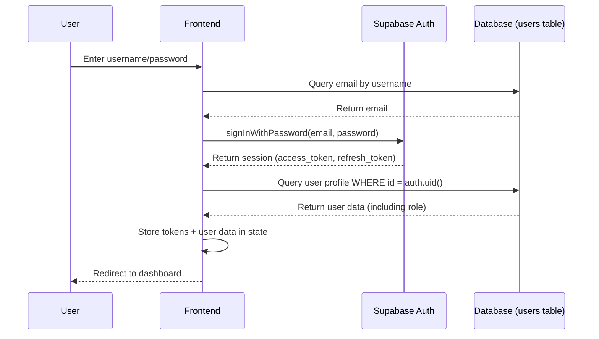
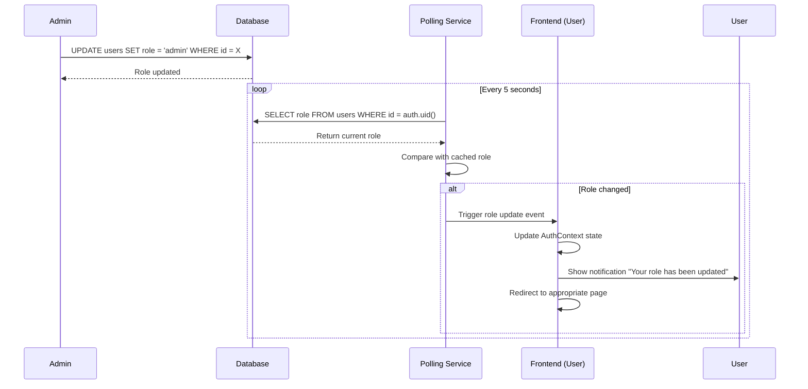

# Design Document - Supabase Native Authentication Migration

## Overview

Migrasi dari sistem autentikasi custom JWT claims ke Supabase native authentication untuk menghilangkan masalah role persistence. Sistem baru akan mengambil role langsung dari database pada setiap request, bukan menyimpannya di JWT token.

### Current Problems

1. **JWT Token Caching Role**: Custom hook `custom_access_token_hook` menambahkan `user_role` ke JWT claims saat login
2. **Stale Role Data**: Ketika admin mengubah role di database, JWT token lama masih menyimpan role lama
3. **Login Failure**: User tidak bisa login karena mismatch antara role di token vs database
4. **Complex Logic**: Custom JWT hook menambah complexity dan maintenance burden

### Solution Approach

**Remove custom JWT claims entirely** dan gunakan database sebagai single source of truth untuk role:
- Login hanya menggunakan `supabase.auth.signInWithPassword` tanpa custom logic
- Role selalu di-query dari tabel `users` berdasarkan `auth.uid()`
- RLS policies menggunakan subquery untuk mendapatkan role real-time
- Frontend polling untuk mendeteksi perubahan role

## Architecture

### High-Level Flow

```
┌─────────────┐
│   Frontend  │
│  (React)    │
└──────┬──────┘
       │
       │ 1. Login (email/password)
       ▼
┌─────────────────────┐
│  Supabase Auth      │
│  (Native)           │
└──────┬──────────────┘
       │
       │ 2. Returns: access_token, refresh_token
       │    (NO custom claims)
       ▼
┌─────────────────────┐
│  Frontend Storage   │
│  - access_token     │
│  - refresh_token    │
│  - NO role cached   │
└──────┬──────────────┘
       │
       │ 3. Every request: Query role from DB
       ▼
┌─────────────────────┐
│  users table        │
│  - id (auth.uid())  │
│  - role             │
│  - username         │
│  - email            │
└─────────────────────┘
```

### Authentication Flow



### Role Change Detection Flow




## Components and Interfaces

### 1. Database Layer

#### Remove Custom JWT Hook

**Current Implementation:**
```sql
CREATE OR REPLACE FUNCTION custom_access_token_hook(event jsonb)
RETURNS jsonb
LANGUAGE plpgsql
AS $$
DECLARE
  claims jsonb;
  user_role text;
BEGIN
  -- Fetch the user role from the users table
  SELECT role::text INTO user_role
  FROM public.users
  WHERE id = (event->>'user_id')::uuid;

  -- Add user_role to the claims
  claims := event->'claims';
  claims := jsonb_set(claims, '{user_role}', to_jsonb(user_role::text));
  event := jsonb_set(event, '{claims}', claims);

  RETURN event;
END;
$$;
```

**Action:** DROP this function and remove hook configuration

#### Update RLS Policies

**Pattern to Replace:**
```sql
-- OLD: Using JWT claims (REMOVE)
CREATE POLICY "Admins can read all"
ON some_table FOR SELECT
USING (
  (auth.jwt() ->> 'user_role') = 'admin'
);
```

**New Pattern:**
```sql
-- NEW: Query from users table
CREATE POLICY "Admins can read all"
ON some_table FOR SELECT
USING (
  (SELECT role FROM users WHERE id = auth.uid()) = 'admin'
);
```

**Optimization:** Add index for performance
```sql
CREATE INDEX IF NOT EXISTS idx_users_id_role ON users(id, role);
```

### 2. Frontend - Auth Service

**File:** `src/features/member-area/services/auth.service.ts`

#### Login Function (Simplified)

```typescript
export const login = async (credentials: LoginCredentials): Promise<{
  token: string;
  refreshToken: string;
  user: User;
}> => {
  // 1. Convert username to email if needed
  let email = credentials.identifier;
  if (!credentials.identifier.includes('@')) {
    const { data } = await supabase
      .from('users')
      .select('email')
      .eq('username', credentials.identifier)
      .single();
    email = data?.email;
  }
  
  // 2. Sign in with Supabase Auth (NO custom logic)
  const { data: authData, error } = await supabase.auth.signInWithPassword({
    email,
    password: credentials.password,
  });
  
  if (error) throw error;
  
  // 3. Fetch user profile (including role) from database
  const { data: profile } = await supabase
    .from('users')
    .select('*')
    .eq('id', authData.user.id)
    .single();
  
  // 4. Return tokens and user data
  return {
    token: authData.session.access_token,
    refreshToken: authData.session.refresh_token,
    user: mapToUser(profile),
  };
};
```

#### Get Current User (Always Fresh Role)

```typescript
export const getCurrentUser = async (): Promise<User | null> => {
  // 1. Get session from Supabase
  const { data: { session } } = await supabase.auth.getSession();
  if (!session) return null;
  
  // 2. Query user profile (role is always fresh from DB)
  const { data: profile } = await supabase
    .from('users')
    .select('*')
    .eq('id', session.user.id)
    .single();
  
  return profile ? mapToUser(profile) : null;
};
```

### 3. Frontend - Auth Context

**File:** `src/features/member-area/contexts/AuthContext.tsx`

#### Remove Role Caching

**Current (REMOVE):**
```typescript
// ❌ Don't cache role in localStorage
localStorage.setItem(USER_DATA_KEY, JSON.stringify(userData));
```

**New Approach:**
```typescript
// ✅ Only cache tokens, query role on demand
localStorage.setItem(TOKEN_KEY, session.access_token);
localStorage.setItem(REFRESH_TOKEN_KEY, session.refresh_token);
// NO user data caching
```

#### Add Role Polling

```typescript
useEffect(() => {
  if (!user) return;
  
  // Poll for role changes every 5 seconds
  const interval = setInterval(async () => {
    const { data } = await supabase
      .from('users')
      .select('role')
      .eq('id', user.id)
      .single();
    
    if (data && data.role !== user.role) {
      console.log('Role changed:', user.role, '->', data.role);
      
      // Update user state
      setUser({ ...user, role: data.role });
      
      // Show notification
      toast.info(`Your role has been updated to ${data.role}`);
      
      // Redirect if needed
      if (data.role === 'admin' && !location.pathname.startsWith('/admin')) {
        navigate('/admin/dashboard');
      } else if (data.role === 'member' && location.pathname.startsWith('/admin')) {
        navigate('/dashboard');
      }
    }
  }, 5000);
  
  return () => clearInterval(interval);
}, [user]);
```

#### Alternative: Realtime Subscription

```typescript
useEffect(() => {
  if (!user) return;
  
  // Subscribe to role changes via Supabase Realtime
  const subscription = supabase
    .channel('user-role-changes')
    .on(
      'postgres_changes',
      {
        event: 'UPDATE',
        schema: 'public',
        table: 'users',
        filter: `id=eq.${user.id}`,
      },
      (payload) => {
        const newRole = payload.new.role;
        if (newRole !== user.role) {
          console.log('Role changed via realtime:', user.role, '->', newRole);
          setUser({ ...user, role: newRole });
          toast.info(`Your role has been updated to ${newRole}`);
          // Handle redirect...
        }
      }
    )
    .subscribe();
  
  return () => {
    subscription.unsubscribe();
  };
}, [user]);
```


### 4. Frontend - Protected Routes

**File:** `src/features/member-area/components/ProtectedRoute.tsx`

#### Query Role on Every Route Check

```typescript
const ProtectedRoute: React.FC<Props> = ({ children, requiredRole }) => {
  const { user, isLoading } = useAuth();
  const [roleCheck, setRoleCheck] = useState<'checking' | 'allowed' | 'denied'>('checking');
  
  useEffect(() => {
    const checkRole = async () => {
      if (!user) {
        setRoleCheck('denied');
        return;
      }
      
      // Query fresh role from database
      const { data } = await supabase
        .from('users')
        .select('role')
        .eq('id', user.id)
        .single();
      
      const currentRole = data?.role;
      
      if (requiredRole && currentRole !== requiredRole) {
        setRoleCheck('denied');
      } else {
        setRoleCheck('allowed');
      }
    };
    
    checkRole();
  }, [user, requiredRole]);
  
  if (isLoading || roleCheck === 'checking') {
    return <LoadingSpinner />;
  }
  
  if (roleCheck === 'denied') {
    return <Navigate to="/unauthorized" />;
  }
  
  return <>{children}</>;
};
```

### 5. Backend - RLS Policies Update

#### Identify All Policies Using JWT Claims

**Query to find affected policies:**
```sql
SELECT 
  schemaname,
  tablename,
  policyname,
  pg_get_expr(qual, (schemaname || '.' || tablename)::regclass) as policy_definition
FROM pg_policies
WHERE pg_get_expr(qual, (schemaname || '.' || tablename)::regclass) LIKE '%auth.jwt()%'
   OR pg_get_expr(qual, (schemaname || '.' || tablename)::regclass) LIKE '%user_role%';
```

#### Update Pattern for Each Policy

**Example 1: users table**
```sql
-- DROP old policy
DROP POLICY IF EXISTS "Admins can read all users" ON users;

-- CREATE new policy with subquery
CREATE POLICY "Admins can read all users"
ON users FOR SELECT
USING (
  (SELECT role FROM users WHERE id = auth.uid()) = 'admin'
);
```

**Example 2: products table**
```sql
-- DROP old policy
DROP POLICY IF EXISTS "Admins can manage products" ON products;

-- CREATE new policy
CREATE POLICY "Admins can manage products"
ON products FOR ALL
USING (
  (SELECT role FROM users WHERE id = auth.uid()) = 'admin'
);
```

**Example 3: transactions table**
```sql
-- Users can read own transactions
DROP POLICY IF EXISTS "Users can read own transactions" ON transactions;

CREATE POLICY "Users can read own transactions"
ON transactions FOR SELECT
USING (
  user_id = auth.uid()
  OR (SELECT role FROM users WHERE id = auth.uid()) = 'admin'
);
```

## Data Models

### User Model (No Changes)

```typescript
interface User {
  id: string;
  username: string;
  email: string;
  fullName: string;
  balance: number;
  role: 'guest' | 'member' | 'admin';  // Queried from DB, not cached
  createdAt: string;
  updatedAt: string;
}
```

### Auth State (Simplified)

```typescript
interface AuthState {
  // Stored in localStorage
  accessToken: string | null;
  refreshToken: string | null;
  
  // Stored in React state (NOT localStorage)
  user: User | null;
  isLoading: boolean;
}
```

### Session Storage Strategy

**Before (Complex):**
```
localStorage:
  - authToken (JWT with user_role claim)
  - refreshToken
  - userData (cached user object with role)
```

**After (Simple):**
```
localStorage:
  - authToken (JWT without custom claims)
  - refreshToken
  
React State:
  - user (fetched fresh from DB)
```

## Error Handling

### 1. Login Errors

```typescript
try {
  await login(credentials);
} catch (error) {
  if (error.message.includes('Invalid login credentials')) {
    showError('Username atau password salah');
  } else if (error.message.includes('Email not confirmed')) {
    showError('Email belum diverifikasi');
  } else if (error.status === 429) {
    showError('Terlalu banyak percobaan login');
  } else {
    showError('Login gagal. Silakan coba lagi.');
  }
}
```

### 2. Role Query Errors

```typescript
const getUserRole = async (userId: string): Promise<string | null> => {
  try {
    const { data, error } = await supabase
      .from('users')
      .select('role')
      .eq('id', userId)
      .single();
    
    if (error) {
      console.error('Failed to fetch role:', error);
      // Fallback to 'member' for safety
      return 'member';
    }
    
    return data?.role || 'member';
  } catch (error) {
    console.error('Role query exception:', error);
    return 'member';
  }
};
```

### 3. Session Expiry

```typescript
// Auto-refresh token before expiry
useEffect(() => {
  const { data: authListener } = supabase.auth.onAuthStateChange(
    async (event, session) => {
      if (event === 'TOKEN_REFRESHED') {
        console.log('Token refreshed');
        localStorage.setItem(TOKEN_KEY, session.access_token);
      } else if (event === 'SIGNED_OUT') {
        console.log('Session expired');
        clearAuthTokens();
        navigate('/login');
      }
    }
  );
  
  return () => authListener.subscription.unsubscribe();
}, []);
```

### 4. RLS Policy Errors

```typescript
// Handle permission denied errors
const handleSupabaseError = (error: any) => {
  if (error.code === 'PGRST301') {
    // RLS policy violation
    showError('You do not have permission to perform this action');
    navigate('/unauthorized');
  } else if (error.code === '42501') {
    // Insufficient privilege
    showError('Access denied');
    navigate('/unauthorized');
  } else {
    showError('An error occurred. Please try again.');
  }
};
```


## Testing Strategy

### 1. Unit Tests

#### Auth Service Tests

```typescript
describe('auth.service', () => {
  describe('login', () => {
    it('should login with email and return user with role from DB', async () => {
      // Mock Supabase responses
      mockSupabase.auth.signInWithPassword.mockResolvedValue({
        data: { session: mockSession, user: mockAuthUser },
        error: null,
      });
      
      mockSupabase.from('users').select().eq().single.mockResolvedValue({
        data: { ...mockUser, role: 'admin' },
        error: null,
      });
      
      const result = await login({ identifier: 'test@example.com', password: 'pass' });
      
      expect(result.user.role).toBe('admin');
      expect(mockSupabase.from).toHaveBeenCalledWith('users');
    });
    
    it('should convert username to email before login', async () => {
      mockSupabase.from('users').select('email').eq().single.mockResolvedValue({
        data: { email: 'test@example.com' },
        error: null,
      });
      
      await login({ identifier: 'testuser', password: 'pass' });
      
      expect(mockSupabase.auth.signInWithPassword).toHaveBeenCalledWith({
        email: 'test@example.com',
        password: 'pass',
      });
    });
  });
  
  describe('getCurrentUser', () => {
    it('should fetch fresh role from database', async () => {
      mockSupabase.auth.getSession.mockResolvedValue({
        data: { session: mockSession },
        error: null,
      });
      
      mockSupabase.from('users').select().eq().single.mockResolvedValue({
        data: { ...mockUser, role: 'member' },
        error: null,
      });
      
      const user = await getCurrentUser();
      
      expect(user?.role).toBe('member');
      expect(mockSupabase.from).toHaveBeenCalledWith('users');
    });
  });
});
```

#### Auth Context Tests

```typescript
describe('AuthContext', () => {
  it('should detect role change via polling', async () => {
    const { result } = renderHook(() => useAuth(), { wrapper: AuthProvider });
    
    // Initial role
    act(() => {
      result.current.setUser({ ...mockUser, role: 'member' });
    });
    
    // Mock role change in DB
    mockSupabase.from('users').select().eq().single.mockResolvedValue({
      data: { ...mockUser, role: 'admin' },
      error: null,
    });
    
    // Wait for polling interval
    await waitFor(() => {
      expect(result.current.user?.role).toBe('admin');
    }, { timeout: 6000 });
  });
  
  it('should not cache role in localStorage', () => {
    const { result } = renderHook(() => useAuth(), { wrapper: AuthProvider });
    
    act(() => {
      result.current.login({ identifier: 'test', password: 'pass' });
    });
    
    const cachedData = localStorage.getItem('userData');
    expect(cachedData).toBeNull();
  });
});
```

### 2. Integration Tests

#### Role Change Flow

```typescript
describe('Role Change Integration', () => {
  it('should allow login after role change', async () => {
    // 1. Create user as member
    const { data: authData } = await supabase.auth.admin.createUser({
      email: 'test@example.com',
      password: 'password123',
    });
    
    await supabase.from('users').insert({
      id: authData.user.id,
      username: 'testuser',
      email: 'test@example.com',
      role: 'member',
    });
    
    // 2. Login as member
    const { data: session1 } = await supabase.auth.signInWithPassword({
      email: 'test@example.com',
      password: 'password123',
    });
    
    expect(session1.session).toBeTruthy();
    
    // 3. Change role to admin
    await supabase.from('users').update({ role: 'admin' }).eq('id', authData.user.id);
    
    // 4. Logout
    await supabase.auth.signOut();
    
    // 5. Login again (should work)
    const { data: session2, error } = await supabase.auth.signInWithPassword({
      email: 'test@example.com',
      password: 'password123',
    });
    
    expect(error).toBeNull();
    expect(session2.session).toBeTruthy();
    
    // 6. Verify role is admin
    const { data: user } = await supabase
      .from('users')
      .select('role')
      .eq('id', authData.user.id)
      .single();
    
    expect(user.role).toBe('admin');
  });
});
```

#### RLS Policy Tests

```typescript
describe('RLS Policies', () => {
  it('should allow admin to read all users', async () => {
    // Login as admin
    await supabase.auth.signInWithPassword({
      email: 'admin@example.com',
      password: 'password',
    });
    
    // Query all users
    const { data, error } = await supabase.from('users').select('*');
    
    expect(error).toBeNull();
    expect(data.length).toBeGreaterThan(0);
  });
  
  it('should prevent member from reading all users', async () => {
    // Login as member
    await supabase.auth.signInWithPassword({
      email: 'member@example.com',
      password: 'password',
    });
    
    // Try to query all users
    const { data, error } = await supabase.from('users').select('*');
    
    // Should only see own profile
    expect(data.length).toBe(1);
    expect(data[0].email).toBe('member@example.com');
  });
});
```

### 3. E2E Tests

#### Login and Role Change Scenario

```typescript
test('User can login after admin changes their role', async ({ page }) => {
  // 1. Login as member
  await page.goto('/login');
  await page.fill('[name="username"]', 'testuser');
  await page.fill('[name="password"]', 'password123');
  await page.click('button[type="submit"]');
  
  // 2. Verify member dashboard
  await expect(page).toHaveURL('/dashboard');
  await expect(page.locator('text=Member Dashboard')).toBeVisible();
  
  // 3. Admin changes role (simulate via API)
  await changeUserRole('testuser', 'admin');
  
  // 4. Wait for polling to detect change (max 5 seconds)
  await expect(page.locator('text=Your role has been updated')).toBeVisible({ timeout: 6000 });
  
  // 5. Verify redirect to admin dashboard
  await expect(page).toHaveURL('/admin/dashboard');
  await expect(page.locator('text=Admin Dashboard')).toBeVisible();
});
```

### 4. Performance Tests

#### RLS Query Performance

```sql
-- Test query performance with subquery
EXPLAIN ANALYZE
SELECT * FROM products
WHERE (SELECT role FROM users WHERE id = auth.uid()) = 'admin';

-- Should use index on users(id, role)
-- Expected: Index Scan, < 1ms
```

#### Polling Impact

```typescript
test('Polling should not impact app performance', async () => {
  const startTime = performance.now();
  
  // Simulate 100 polling requests
  for (let i = 0; i < 100; i++) {
    await supabase.from('users').select('role').eq('id', userId).single();
  }
  
  const endTime = performance.now();
  const avgTime = (endTime - startTime) / 100;
  
  // Each query should be < 50ms
  expect(avgTime).toBeLessThan(50);
});
```

## Migration Plan

### Phase 1: Preparation (No Downtime)

1. **Audit Current System**
   - List all RLS policies using JWT claims
   - Identify all code using cached role from localStorage
   - Document current auth flow

2. **Create Indexes**
   ```sql
   CREATE INDEX IF NOT EXISTS idx_users_id_role ON users(id, role);
   ```

3. **Add Monitoring**
   - Log all auth operations
   - Track role query performance
   - Monitor session creation/expiry

### Phase 2: Database Migration (Minimal Downtime)

1. **Update RLS Policies**
   ```sql
   -- Run migration script to update all policies
   -- Estimated time: 2-3 minutes
   BEGIN;
   
   -- Drop old policies
   DROP POLICY IF EXISTS "policy_name" ON table_name;
   
   -- Create new policies with subquery
   CREATE POLICY "policy_name" ON table_name
   USING ((SELECT role FROM users WHERE id = auth.uid()) = 'admin');
   
   COMMIT;
   ```

2. **Remove JWT Hook**
   ```sql
   -- Drop custom access token hook
   DROP FUNCTION IF EXISTS custom_access_token_hook(jsonb);
   
   -- Remove hook configuration (via Supabase Dashboard)
   -- Auth > Hooks > Custom Access Token Hook > Remove
   ```

3. **Verify Changes**
   ```sql
   -- Verify no policies use JWT claims
   SELECT * FROM pg_policies
   WHERE pg_get_expr(qual, (schemaname || '.' || tablename)::regclass) LIKE '%auth.jwt()%';
   
   -- Should return 0 rows
   ```

### Phase 3: Frontend Migration (Gradual Rollout)

1. **Update Auth Service**
   - Remove custom JWT logic
   - Simplify login function
   - Update getCurrentUser to query role

2. **Update Auth Context**
   - Remove role caching in localStorage
   - Add role polling or realtime subscription
   - Add role change notification

3. **Update Protected Routes**
   - Query role on route check
   - Add loading state for role verification

4. **Deploy Frontend**
   - Deploy to staging first
   - Test all auth flows
   - Deploy to production with feature flag

### Phase 4: Cleanup and Monitoring

1. **Remove Old Code**
   - Delete unused JWT helper functions
   - Remove role caching logic
   - Clean up localStorage keys

2. **Monitor Performance**
   - Track RLS query times
   - Monitor polling overhead
   - Check for auth errors

3. **Update Documentation**
   - Update auth flow diagrams
   - Document new role query pattern
   - Create troubleshooting guide

### Rollback Plan

If issues occur, rollback in reverse order:

1. **Rollback Frontend**
   - Revert to previous deployment
   - Re-enable role caching

2. **Rollback Database**
   ```sql
   -- Restore old RLS policies
   -- Re-create JWT hook
   -- Re-enable hook in Supabase Dashboard
   ```

3. **Verify Rollback**
   - Test login flow
   - Verify role changes work
   - Check all protected routes

## Performance Considerations

### 1. RLS Query Optimization

**Index Strategy:**
```sql
-- Composite index for role queries
CREATE INDEX idx_users_id_role ON users(id, role);

-- Analyze query plan
EXPLAIN ANALYZE
SELECT role FROM users WHERE id = 'user-uuid';
```

**Expected Performance:**
- Index Scan: < 1ms
- No full table scan
- Consistent performance with 10k+ users

### 2. Polling vs Realtime

**Polling (Recommended for MVP):**
- Pros: Simple, reliable, works everywhere
- Cons: 5-second delay, extra queries
- Impact: ~1 query per user per 5 seconds

**Realtime (Future Enhancement):**
- Pros: Instant updates, no polling overhead
- Cons: Requires Realtime enabled, WebSocket connection
- Impact: Minimal, event-driven

**Decision:** Start with polling, migrate to Realtime later if needed

### 3. Caching Strategy

**What to Cache:**
- ✅ Access token (localStorage)
- ✅ Refresh token (localStorage)

**What NOT to Cache:**
- ❌ User role (query from DB)
- ❌ User permissions (query from DB)
- ❌ User profile (query from DB)

**Rationale:** Database is single source of truth, caching causes stale data

## Security Considerations

### 1. RLS Policy Security

**Ensure policies are secure:**
```sql
-- ✅ GOOD: Subquery is safe
CREATE POLICY "admin_only" ON table_name
USING ((SELECT role FROM users WHERE id = auth.uid()) = 'admin');

-- ❌ BAD: Don't trust client-side role
CREATE POLICY "admin_only" ON table_name
USING (current_setting('request.jwt.claim.user_role') = 'admin');
```

### 2. Token Security

**Best Practices:**
- Store tokens in localStorage (not cookies for SPA)
- Use HTTPS only
- Implement token refresh before expiry
- Clear tokens on logout

### 3. Role Change Audit

**Log all role changes:**
```sql
-- Existing audit log table
INSERT INTO role_audit_logs (user_id, old_role, new_role, changed_by)
VALUES (user_id, 'member', 'admin', auth.uid());
```

## Documentation Updates

### 1. Developer Guide

- Update auth flow diagrams
- Document new role query pattern
- Add troubleshooting section

### 2. API Documentation

- Update auth endpoints
- Document role query behavior
- Add migration guide

### 3. Admin Guide

- Update role management instructions
- Document role change behavior
- Add FAQ section

